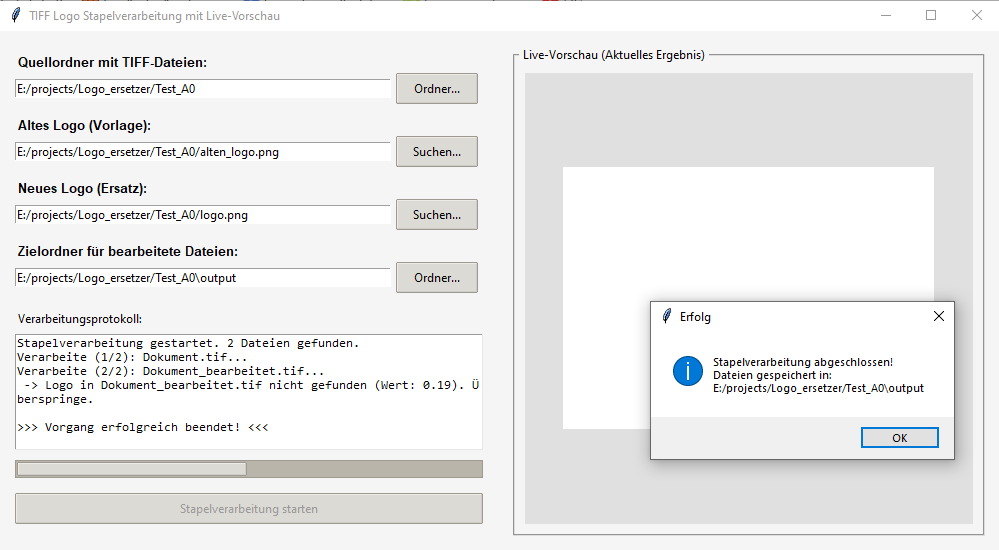

# TIFF Logo Batch Replacer with Live Preview

[](https://python.org)
[](https://opensource.org)

Ein leistungsstarkes, GUI-basiertes Python-Werkzeug zur vollautomatischen Stapelverarbeitung (Batch Processing) von TIFF-Dokumenten. Die Software sucht mithilfe von Computer-Vision ein altes Logo in Dokumenten, ersetzt es präzise und proportional durch ein neues Logo und speichert das Ergebnis stark komprimiert ab.

---

## 🎯 Hauptmerkmale

* **Intelligente Logo-Erkennung**: Verwendet Template Matching (`OpenCV`), um die exakte Position des alten Logos auf Dokumenten unterschiedlicher Auflösung zu finden.
* **Proportionale Skalierung**: Das neue Logo wird automatisch an die Dimensionen des alten Logos angepasst – ohne Verzerrungen.
* **Transparenz-Unterstützung**: Volle Unterstützung für PNG-Vordergrundlogos mit Alpha-Kanälen (Transparenzeffekte).
* **Live-Vorschau (Echtzeit)**: Ein integriertes Vorschaufenster zeigt während der Stapelverarbeitung das aktuelle Zwischenergebnis live an.
* **Effiziente Kompression**: Verhindert riesige TIFF-Dateien durch die direkte Integration der Adobe-Deflate-(ZIP)-Komprimierung über die Pillow-Bibliothek.
* **Asynchrone Verarbeitung**: Dank Multithreading bleibt die Benutzeroberfläche (GUI) auch bei hunderten Dokumenten flüssig und friert nicht ein.

---

## 📸 Benutzeroberfläche
## Screenshot



Das zweispaltige Layout trennt die Steuerungselemente sauber von der visuellen Rückmeldung:

* **Linke Spalte**: Pfadauswahl für Quellordner, Zielordner sowie die Bilddateien (Logos), inklusive Fortschrittsbalken und Echtzeit-Verarbeitungsprotokoll.
* **Rechte Spalte**: Skalierte Live-Bildvorschau des aktuell bearbeiteten Dokuments.

---

## 🛠️ Installation & Voraussetzungen

### 1. Python installieren
Stelle sicher, dass Python (Version 3.8 oder neuer) installiert ist.

### 2. Abhängigkeiten installieren
Installiere die benötigten Bibliotheken ganz einfach über dein Terminal oder die Eingabeaufforderung (CMD):

```bash
pip install opencv-python pillow
```

*Hinweis: `tkinter` ist in den meisten Standard-Python-Installationen für Windows und macOS bereits enthalten.*

---

## 🚀 Verwendung

1. Starte das Skript über das Terminal:
   ```bash
   python logo_replacer.py
   ```
2. **Quellordner wählen**: Wähle das Verzeichnis aus, das die zu bearbeitenden `.tif`- oder `.tiff`-Dateien enthält.
3. **Altes Logo (Vorlage)**: Wähle das Bild des Logos aus, nach dem im Dokument gesucht werden soll.
4. **Neues Logo**: Wähle das Ersatzlogo (idealerweise als `.png` mit transparentem Hintergrund).
5. **Zielordner**: Bestimme den Ausgabeordner (standardmäßig wird automatisch ein Unterordner `/output` im Quellverzeichnis vorgeschlagen).
6. Klicke auf **Stapelverarbeitung starten**.

---

## 🔍 Technische Funktionsweise

1. **Template Matching**: `cv2.matchTemplate()` sucht im Graustufenmodus nach der besten Übereinstimmung mit dem alten Logo. Ein Schwellenwert von `0.8` sorgt für eine präzise Erkennung und verhindert Fehlanpassungen.
2. **Zentrierung & Maskierung**: Das Skript berechnet den exakten Mittelpunkt des alten Logos. Bei PNGs mit Alpha-Kanal wird eine bitweise Invertierungsmaske erstellt, um das neue Logo nahtlos ohne Artefakte in den Hintergrund einzubetten.
3. **Speicheroptimierung**: Das Bild wird via NumPy von BGR nach RGB konvertiert und mittels `hauptbild_pil.save(..., compression="tiff_adobe_deflate")` speichereffizient komprimiert abgelegt.

---

## 📄 Lizenz

Dieses Projekt ist unter der MIT-Lizenz lizenziert. Siehe die [LICENSE](LICENSE)-Datei für Details.

---

## 👥 Mitwirken & Support

Beiträge, Fehlerberichte und Feature-Anfragen sind herzlich willkommen! Erstelle dazu einfach ein Issue oder einen Pull Request.

*Copyright (C) Noel Joan - 2026. Alle Rechte vorbehalten.*
